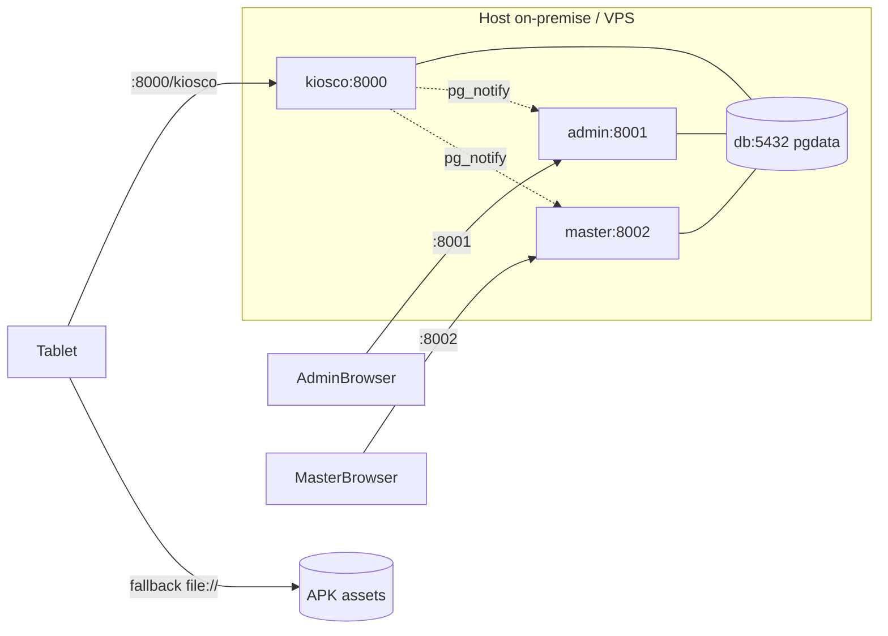

# Arquitectura — Hotel del Valle / CyHotel

> Fuente de verdad técnica. Complementa `README.md` (onboarding) y `README-INFRA.md` (operación). Versión 2026-09-02 · Fase 0.

## 1. Visión General

Sistema de check-in táctil + operación hotelera multi-tenant. Un único codebase Python + Postgres sirve 3 modos de app desde el mismo `Dockerfile` con `APP_MODE`.

**Principios:**
- **Offline-first:** el kiosco funciona sin internet (LAN + APK embebido + cola offline).
- **Fuente de verdad única:** Postgres on-premise; VPS es réplica operativa/admin.
- **Operación 24/7:** healthchecks, worker de expiración, `LISTEN/NOTIFY` para tiempo real, backups diarios.
- **Tablet 8" elegible por ancianos:** tipografía gigante, sin scroll, 130px targets.

## 2. Modelo C4

### Nivel 1 — Contexto


### Nivel 2 — Contenedores (docker-compose `cyhotel-deploy`)

| Contenedor | `APP_MODE` | Imagen | Puerto host | Rol |
|---|---|---|---|---|
| `db` | — | `postgres:16-alpine` | ninguno | PG 16 + volumen `pgdata` |
| `kiosco` | `kiosco` | `Dockerfile` `ARG APP_MODE=kiosco` | 8000 | Público: `/kiosco`, `/api/types`, `/api/orders POST`, `/api/kiosco-*` |
| `admin` | `admin` | mismo `Dockerfile` | 8001 | Hotel Hotel del Valle (`HOTEL_ID=1`), API completa + worker |
| `master` | `master` | mismo `Dockerfile` | 8002 | Consolidado todos los hoteles |

`kiosco` monta `./web:/app/web` (bind) — rebuild `npm run build` se refleja sin rebuild de imagen. `backend/` no es bind — requiere `docker cp` + `restart`.



### Nivel 3 — Componentes Backend (`backend/server.py` 3427 LOC hoy)

```
Handler (BaseHTTPRequestHandler)
├── _serve_react_spa /_serve_static /_serve_apk /_serve_upload
├── do_GET: /api/health, /api/catalog, /api/types, /api/kiosco-*, /api/rooms, /api/orders, /api/events (SSE)
├── do_POST: /api/orders, /api/orders/:id/{assign,pay,cancel,checkout,extend}, /api/rooms/:id/status, /api/housekeeping/*
├── _require_auth (sessions dict, 12h, scope/role)
├── pg_notify_change (dentro de tx, canal cyhotel_changed)
├── notify_listener_loop (LISTEN, select 10s, sse_broadcast)
└── worker_loop (35s, _tick_hotel ×4 expiraciones por hotel)
db.py: ThreadedConnectionPool 1-20, RLS, SCHEMA 11 tablas, FEATURE_MIGRATIONS
```

### Nivel 3 — Componentes Frontend

```
web/kiosco (React 18 + Vite + Tailwind)
├── App.tsx (orquestador, Idle timer, PIN, OTA bridge __updateStatus)
├── store.ts (Context + navDir)
├── screens/ PlanScreen / RoomScreen / CheckinScreen / IdleScreen
├── components/ PlanCard / RoomCard / CheckinForm / ui/*
├── lib/ pricing / validation / haptics / cn
└── api.ts (resolveApiBase, retryFetch, cache, offlineQueue localStorage)

web/admin.html (vanilla 181KB), web-master/master.html (vanilla)
android-shell (Kotlin, MainActivity 937 LOC, WebView + OTA + kiosk)
```

## 3. Datos

### Esquema (Postgres, `db.py SCHEMA`)

`hotels(id, slug UNIQUE, nombre, activo, config JSONB, created_at)`
`users(id, hotel_id FK NULL master, username, password_hash, role CHECK, UNIQUE(hotel_id,username))`
`rooms(id, hotel_id FK, number, type, status CHECK libre/ocupado/en_limpieza/bloqueado, UNIQUE(hotel_id,number))`
`orders(id, hotel_id FK, room_id FK NULL, guest_name, id_document, product CHECK, room_type, hours, check_in/out TIMESTAMPTZ, subtotal NUMERIC(10,2), status CHECK 7, payment_method, client_ref UNIQUE(hotel_id,client_ref), hold_expires_at, paid_at/by, created_at)`
`payments(id, hotel_id FK, order_id FK, amount_cents, method, reference, paid_at, recorded_by, idempotency_key UNIQUE(hotel_id,key))`
`cleaning_tasks(id, hotel_id FK, room_id FK, order_id FK NULL, status CHECK 5, assigned_to, started_at, completed_at, notes)`
`housekeeping_staff(id, hotel_id FK, name UNIQUE, active)`
`incidences(id, hotel_id FK, task_id FK, room_id FK, notes, status, created_by/at, resolved_*)`
`room_status_history(id, hotel_id FK, room_id INT, status, changed_at)` — FK pendiente
`audit_log(id, hotel_id NULL, action, order_id, room_id, staff_user, details, created_at)`
`schema_meta(key PK, value)`

**RLS:** `current_hotel_id() STABLE` lee `current_setting('app.hotel_id')`; `FORCE RLS` + `USING (current_hotel_id() IS NULL OR hotel_id = current_hotel_id())` en todas las tablas de tenant. Conexión app usa `cyhotel_app` (no superuser). `set_app_hotel(conn, hotel_id|"master")`.

**Índices calientes:** `idx_orders_status_checkout`, `idx_orders_hold`, `idx_orders_room_type`, `idx_cleaning_room_status`, `idx_payments_paid_at`, `idx_audit_created`.

**Seeds:** 19 habitaciones (11 estándar, 5 matrimonial, 2 doble, 1 suite), 3 usuarios hotel + 1 master (passwords vía `CYHOTEL_SEED_*_PASS`).

### Config por hotel (`hotels.config JSONB`)
`{reserva_tarifa, assign_ttl_minutes, max_days, max_days_full, qr_url, idle_timeout, promos[], price_overrides{}, branding{hotel,tagline}, suite_durations{}}`. Override soporta 2 formas; aplicado en `GET /types` (pendiente unificar con `POST /orders`).

## 4. API — Resumen

Ver `docs/api_contract_v2.md` (contrato) y `backend/openapi.yaml` (spec). Públicos sin auth: `GET /api/health, /api/catalog, /api/types, POST /api/orders, GET /api/kiosco-* , POST /api/kiosco-crash`. Auth `POST /api/admin/login|pin-login → Bearer 12h`. Admin: `rooms`, `orders`, `reservations`, `housekeeping`, `dashboard/*`, `hotel/settings`, `audit`, `events (SSE)`. Master: `/api/master/*`. Realtime: `pg_notify('cyhotel_changed')` → `LISTEN` en admin/master → `SSE /api/events?token=`.

State machine órdenes: `por_asignar → pendiente → pagado|confirmada → finalizada | vencida|anulado` (worker 35s).

## 5. Decisiones de Arquitectura (ADRs)

### ADR-001 — Un solo `server.py` con `APP_MODE` vs 3 servicios distintos
**Decisión:** un Dockerfile + `APP_MODE` (kiosco/admin/master). **Por qué:** deploy simple, 1 imagen, 3 contenedores. **Consecuencia:** `sessions` en memoria no se comparten (login en admin no vale en master). **Mitigación Fase 1:** tabla `sessions` o JWT.

### ADR-002 — `ThreadingHTTPServer` stdlib sin framework
**Decisión:** stdlib + `psycopg2` solo. **Por qué:** imagen mínima, sin deps, boot rápido en Mini-PC. **Consecuencia:** sin async, `ThreadedConnectionPool 20` puede bloquear en picos. **Mitigación:** `pgbouncer` transacción cuando escale a 8 hoteles (README-INFRA).

### ADR-003 — RLS con `FORCE` + `cyhotel_app`
**Decisión:** multi-tenant vía RLS. **Por qué:** aislamiento a nivel BD. **Consecuencia:** hoy `DATABASE_URL` usa superuser `cyhotel` que evade RLS. **Fix Fase 2:** usar `cyhotel_app` en app; superuser solo en `_admin_db()`.

### ADR-004 — Tiempo real vía `LISTEN/NOTIFY` + SSE
**Decisión:** puente `pg_notify` dentro de tx → `LISTEN` en admin/master → `SSE`. **Por qué:** sin Redis, latencia ~23ms verificada. **Consecuencia:** solo admin/master escuchan; kiosco solo notifica.

### ADR-005 — UI híbrida: server + APK embebido + cola offline
**Decisión:** WebView carga del server con fallback `file:///android_asset/kiosco` y `localStorage` queue. **Por qué:** update fácil sin reinstall; funciona sin red. **Consecuencia:** `localStorage` 5MB, SW cachea `/api/*`. **Mejora Fase 4:** `IndexedDB` + `Workbox NetworkOnly` para API.

## 6. Escalabilidad y Deuda Conocida

Ver `README-INFRA.md` §Auditoría (deadlock retry 3×, índices, worker por hotel) y §Recomendaciones (pgbouncer, WAL PITR, REPEATABLE READ). Frontend: 3 paletas divergentes, sin router, Context god-store, SW precache pesado — ver plan Fase 4.

## 7. Roadmap (post Fase 0)

Fase 1 fundación (`tokens.css`, `packages/shared`, validación config), Fase 2 BD (RLS fix, sesiones, pricing unificado), Fase 3 backend modular (`backend/app/routes|services`), Fase 4 frontend (`zustand+tanstack/query`, `react-router`, Workbox), Fase 5 marca (sesión fotos), Fase 6 Android (split MainActivity, PackageInstaller silent).

## 8. Referencias

- `backend/server.py`, `backend/db.py`, `backend/worker.py`
- `web/kiosco/src/*`, `web/admin.html`, `web-master/master.html`, `android-shell/`
- `docker-compose.yml`, `Dockerfile`, `scripts/backup.sh|monitor.sh`
- `docs/brand/01_estrategia_marca.md`, `02_identidad_visual.md`, `03_brand_kit.md`, `docs/brand/DECISION.md`
- `docs/api_contract_v2.md`, `backend/openapi.yaml`
