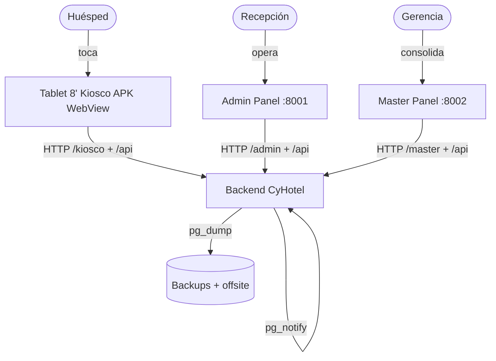
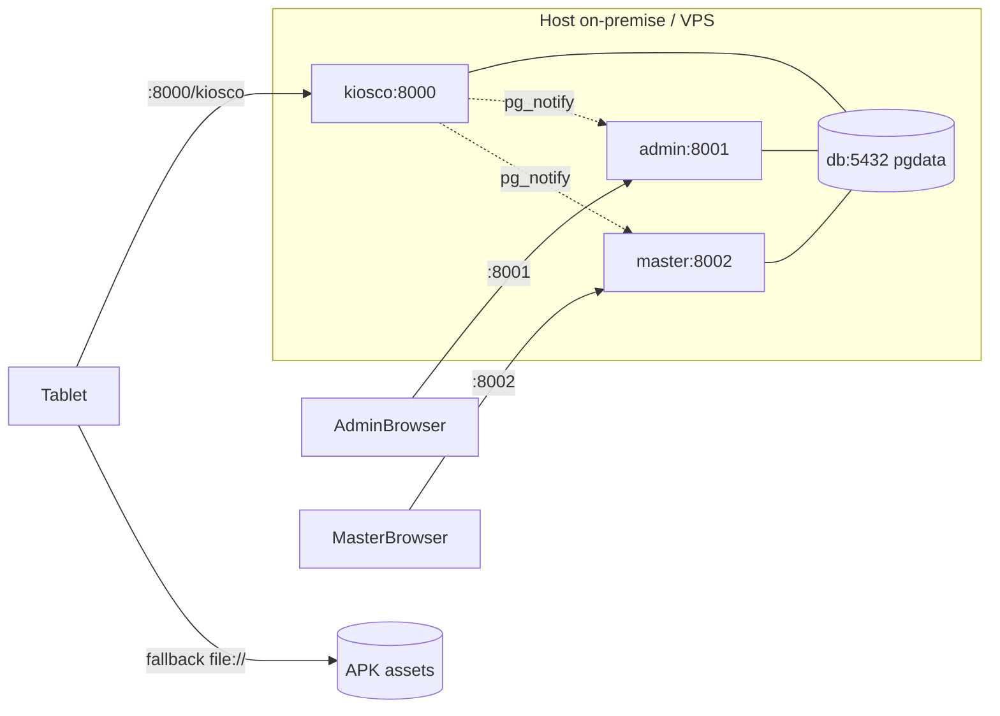

# Arquitectura — Hotel del Valle / CyHotel

> Fuente de verdad técnica. Complementa `README.md` (onboarding) y `README-INFRA.md` (operación). Versión 2026-09-02 · Fase 3c (auditoría DB/sessions PG).

## 1. Visión General

Sistema de check-in táctil + operación hotelera multi-tenant. Un único codebase Python + Postgres sirve 3 modos de app desde el mismo `Dockerfile` con `APP_MODE`.

**Principios:**
- **Offline-first:** el kiosco funciona sin internet (LAN + APK embebido + cola offline).
- **Fuente de verdad única:** Postgres on-premise; VPS es réplica operativa/admin.
- **Operación 24/7:** healthchecks, worker de expiración, `LISTEN/NOTIFY` para tiempo real, backups diarios.
- **Tablet 8" elegible por ancianos:** tipografía gigante, sin scroll, 130px targets.

## 2. Modelo C4

### Nivel 1 — Contexto



### Nivel 2 — Contenedores (docker-compose `cyhotel-deploy`)

| Contenedor | `APP_MODE` | Imagen | Puerto host | Rol |
|---|---|---|---|---|
| `db` | — | `postgres:16-alpine` | ninguno | PG 16 + volumen `pgdata` |
| `kiosco` | `kiosco` | `Dockerfile` `ARG APP_MODE=kiosco` | 8000 | Público: `/kiosco`, `/api/types`, `/api/orders POST`, `/api/kiosco-*` |
| `admin` | `admin` | mismo `Dockerfile` | 8001 | Hotel Hotel del Valle (`HOTEL_ID=1`), API completa + worker |
| `master` | `master` | mismo `Dockerfile` | 8002 | Consolidado todos los hoteles |

`kiosco` monta `./web:/app/web` (bind) — rebuild `npm run build` se refleja sin rebuild de imagen. `backend/` no es bind — requiere `docker cp` + `restart`.



### Nivel 3 — Componentes Backend (`backend/server.py` ~3614 LOC + `backend/app/*` Fase 2-3)

```
Handler (BaseHTTPRequestHandler) — backend/server.py
├── _serve_react_spa /_serve_static /_serve_apk /_serve_upload
├── do_GET: /api/health, /api/catalog, /api/types, /api/kiosco-*, /api/rooms, /api/orders, /api/events (SSE)
├── do_POST: /api/orders, /api/orders/:id/{assign,pay,cancel,checkout,extend}, /api/rooms/:id/status, /api/housekeeping/*
├── _require_auth (delega a app/services/auth.py:get_session, 12h, scope/role; fallback dict _sessions_mem para transición)
├── pg_notify_change (dentro de tx, canal cyhotel_changed)
├── notify_listener_loop (LISTEN, select 10s, sse_broadcast)
└── worker_loop (35s, _tick_hotel ×4 expiraciones por hotel + _cleanup_sessions)

db.py: ThreadedConnectionPool 1-20, RLS FORCE via current_hotel_id(), SCHEMA 12 tablas (incl. sessions PG), FEATURE_MIGRATIONS (cleaning_pausada, incidences_tabla, cleaning_staff, sessions, missing_indexes, suite_product) — ver backend/db.py:460-509
app/services/* (extraídos Fase 2-3, import-safe con fallback):
├── auth.py: create_session/get_session/delete_session/cleanup_expired → PG sessions (token PK, hotel_id FK NULL, expires TIMESTAMPTZ) + idx_sessions_expires/hotel, sin RLS (global) — ver backend/app/services/auth.py:16-130
├── pricing.py: get_price_overrides(conn, hotel_id, hotel_config_fn), apply_price_override, suite_subtotal — single source para GET /types y POST /orders (suite momento/amanecida/hospedaje) — ver backend/app/services/pricing.py:5-65
├── validation.py: validate_hotel_config(cfg) — price_overrides, branding, max_days, suite_durations, qr_url, reserva_tarifa, assign_ttl_minutes, cleaning_sla_minutes — ver backend/app/services/validation.py:3-72
├── orders.py: ORDER_PRODUCTS=(momento,amanecida,hospedaje,suite,reserva), _apply_price_override/_suite_subtotal, validación payload y cálculo subtotal/check_in/out — ver backend/app/services/orders.py:45-116
├── rooms.py / housekeeping.py: lógica de habitaciones y tareas (Fase 3b)
app/config.py: APP_MODE, HOTEL_ID (env HOTEL_ID, default 1 si admin/kiosco sin valor — ver backend/server.py:80-88), PG*, TOKEN_TTL_HOURS=12 — ver backend/app/config.py:4-18
app/db/__init__.py: re-export db pool/helpers para imports limpios — ver backend/app/db/__init__.py:1-13
app/routes/{kiosco,admin,master}.py: stubs Fase 3a (Handler aún en server.py, migración progresiva) — ver backend/app/routes/*.py
worker.py: worker_loop 35s, _tick_hotel por hotel activo + _cleanup_sessions (DELETE FROM sessions WHERE expires < NOW()) — ver backend/worker.py:206-238
```

### Nivel 3 — Componentes Frontend

```
web/kiosco (React 18 + Vite + Tailwind)
├── App.tsx (orquestador, Idle timer, PIN, OTA bridge __updateStatus)
├── store.ts (Context + navDir)
├── screens/ PlanScreen / RoomScreen / CheckinScreen / IdleScreen
├── components/ PlanCard / RoomCard / CheckinForm / ui/*
├── lib/ pricing / validation / haptics / cn
└── api.ts (resolveApiBase, retryFetch, cache, offlineQueue localStorage)

web/admin.html (vanilla 181KB), web-master/master.html (vanilla)
android-shell (Kotlin, MainActivity 937 LOC, WebView + OTA + kiosk)
```

## 3. Datos

### Esquema (Postgres, `db.py SCHEMA`)

`hotels(id, slug UNIQUE, nombre, activo, config JSONB, created_at)`
`users(id, hotel_id FK NULL master, username, password_hash, role CHECK, UNIQUE(hotel_id,username))`
`rooms(id, hotel_id FK, number, type, status CHECK libre/ocupado/en_limpieza/bloqueado, UNIQUE(hotel_id,number))`
`orders(id, hotel_id FK, room_id FK NULL, guest_name, id_document, product CHECK, room_type, hours, check_in/out TIMESTAMPTZ, subtotal NUMERIC(10,2), status CHECK 7, payment_method, client_ref UNIQUE(hotel_id,client_ref), hold_expires_at, paid_at/by, created_at)`
`payments(id, hotel_id FK, order_id FK, amount_cents, method, reference, paid_at, recorded_by, idempotency_key UNIQUE(hotel_id,key))`
`cleaning_tasks(id, hotel_id FK, room_id FK, order_id FK NULL, status CHECK 5, assigned_to, started_at, completed_at, notes)`
`housekeeping_staff(id, hotel_id FK, name UNIQUE, active)`
`incidences(id, hotel_id FK, task_id FK, room_id FK, notes, status, created_by/at, resolved_*)`
`room_status_history(id, hotel_id FK, room_id INT, status, changed_at)` — FK pendiente
`audit_log(id, hotel_id NULL, action, order_id, room_id, staff_user, details, created_at)`
`schema_meta(key PK, value)`
`sessions(token PK TEXT, hotel_id FK NULL → hotels.id, username, role CHECK recepcion/housekeeping/gerencia/master, scope CHECK hotel/master, expires TIMESTAMPTZ, created_at)` — **sin RLS** (tabla global, ver backend/db.py:234-242 y auditoría 2026-09-02: `relrowsecurity=f`, 0 policies) — `idx_sessions_expires (expires)`, `idx_sessions_hotel (hotel_id)` — FK hotel_id NULL para master

**RLS:** `current_hotel_id() STABLE` lee `current_setting('app.hotel_id')` — ver backend/db.py:264-281; `FORCE RLS` + `USING (current_hotel_id() IS NULL OR hotel_id = current_hotel_id())` en 9 tablas tenant (users, rooms, orders, payments, cleaning_tasks, housekeeping_staff, incidences, room_status_history, audit_log) — ver backend/db.py:283-337. `sessions` es global sin RLS (audit 2026-09-02: `relforcerowsecurity=f`). Conexión app debe usar `cyhotel_app` (no superuser, ver backend/db.py:16-17, 340-356); `set_app_hotel(conn, hotel_id|"master")` — ver backend/db.py:406-417 y backend/server.py:357-365. Nota auditoría: `docker-compose.yml:35,62,82` aún usa `DATABASE_URL` con superuser `cyhotel` (evade RLS); fix Fase 2 es cambiar a `cyhotel_app:cyhotel_app`.

**Índices calientes (verificados 2026-09-02 vía `pg_indexes`):** `idx_orders_status_checkout (hotel_id,status,check_out)`, `idx_orders_hold (hotel_id,product,status,hold_expires_at)` ✅, `idx_orders_room_type (hotel_id,room_type,status)` ✅, `idx_orders_product_status`, `idx_orders_created`, `idx_orders_room_status`, `idx_cleaning_room_status (hotel_id,room_id,status)` ✅, `idx_cleaning_status`, `idx_tasks_staff`, `idx_incidences_hotel_status`, `idx_payments_paid_at`, `idx_audit_created`, `idx_sessions_expires` ✅, `idx_sessions_hotel` ✅ — ver backend/db.py:244-258.

**Seeds:** 19 habitaciones (11 estándar, 5 matrimonial, 2 doble, 1 suite), 3 usuarios hotel + 1 master (passwords vía `CYHOTEL_SEED_*_PASS`) — ver backend/db.py:82-104.

### Config por hotel (`hotels.config JSONB`)
`{reserva_tarifa, assign_ttl_minutes, max_days, max_days_full, qr_url, idle_timeout, promos[], price_overrides{}, branding{hotel,tagline}, suite_durations{}}`. Override soporta 2 formas; aplicado en `GET /types` y `POST /orders` ya unificado vía `pricing.get_price_overrides()` — ver backend/server.py:789-809 y backend/app/services/pricing.py:5-16. `_hotel_config(conn, hotel_id)` lee `SELECT config FROM hotels WHERE id=%s` — ver backend/server.py:1514-1516. `price_overrides` validado en `validation.validate_hotel_config()` — ver backend/app/services/validation.py:9-11 y backend/server.py:3018-3019. `HOTEL_ID` env: `backend/server.py:80-88` (parse int, default 1 si admin/kiosco sin valor) y `backend/app/config.py:5` (`HOTEL_ID_ENV`); master no fija hotel (scope master, ver backend/server.py:360-365).

## 4. API — Resumen

Ver `docs/api_contract_v2.md` (contrato) y `backend/openapi.yaml` (spec). Públicos sin auth: `GET /api/health, /api/catalog, /api/types, POST /api/orders, GET /api/kiosco-* , POST /api/kiosco-crash`. Auth `POST /api/admin/login|pin-login → Bearer 12h`. Admin: `rooms`, `orders`, `reservations`, `housekeeping`, `dashboard/*`, `hotel/settings`, `audit`, `events (SSE)`. Master: `/api/master/*`. Realtime: `pg_notify('cyhotel_changed')` → `LISTEN` en admin/master → `SSE /api/events?token=`.

State machine órdenes: `por_asignar → pendiente → pagado|confirmada → finalizada | vencida|anulado` (worker 35s).

## 5. Decisiones de Arquitectura (ADRs)

### ADR-001 — Un solo `server.py` con `APP_MODE` vs 3 servicios distintos
**Decisión:** un Dockerfile + `APP_MODE` (kiosco/admin/master). **Por qué:** deploy simple, 1 imagen, 3 contenedores. **Consecuencia (histórico):** `sessions` en memoria no se compartían (login en admin no valía en master/kiosco). **Mitigación Fase 2-3c aplicada:** tabla `sessions` PG — ver backend/db.py:234-242 + FEATURE_MIGRATIONS `sessions` (backend/db.py:492-497) y `backend/app/services/auth.py:16-130` (create/get/delete con PG + fallback `_sessions_mem` para transición, `TOKEN_TTL 12h`). Auditoría 2026-09-02: `sessions` existe con `idx_sessions_expires` y `idx_sessions_hotel`, sin RLS (global), FK hotel_id NULL para master, `schema_meta` key `sessions=1`; `worker.py:206-217` limpia expiradas cada tick. Login en cualquier contenedor es visible en los otros vía PG.

### ADR-002 — `ThreadingHTTPServer` stdlib sin framework
**Decisión:** stdlib + `psycopg2` solo. **Por qué:** imagen mínima, sin deps, boot rápido en Mini-PC. **Consecuencia:** sin async, `ThreadedConnectionPool 20` puede bloquear en picos. **Mitigación:** `pgbouncer` transacción cuando escale a 8 hoteles (README-INFRA).

### ADR-003 — RLS con `FORCE` + `cyhotel_app`
**Decisión:** multi-tenant vía RLS. **Por qué:** aislamiento a nivel BD. **Estado auditoría 2026-09-02:** `FORCE RLS` verificado en `orders`/`rooms`/`cleaning_tasks`/`payments` (ver `pg_class relforcerowsecurity=t`); `sessions relrowsecurity=f` sin policies — intencional global (ver `pg_policy WHERE polrelid='sessions'::regclass` 0 rows). `current_hotel_id()` STABLE existe — ver backend/db.py:264-281. Conexiones vía `cyhotel_app` (rol no-superuser creado en backend/db.py:340-356, `rolsuper=f` verificado). **Consecuencia pendiente:** `docker-compose.yml:35,62,82` aún trae `DATABASE_URL` con superuser `cyhotel` (`rolsuper=t`, evade RLS); runtime usa `_admin_db()` para init pero `db()` debería usar `cyhotel_app`. **Fix Fase 2:** cambiar compose `DATABASE_URL` a `cyhotel_app`; superuser solo en `_admin_db()` — ver backend/db.py:392-404.

### ADR-004 — Tiempo real vía `LISTEN/NOTIFY` + SSE
**Decisión:** puente `pg_notify` dentro de tx → `LISTEN` en admin/master → `SSE`. **Por qué:** sin Redis, latencia ~23ms verificada. **Consecuencia:** solo admin/master escuchan; kiosco solo notifica.

### ADR-005 — UI híbrida: server + APK embebido + cola offline
**Decisión:** WebView carga del server con fallback `file:///android_asset/kiosco` y `localStorage` queue. **Por qué:** update fácil sin reinstall; funciona sin red. **Consecuencia:** `localStorage` 5MB, SW cachea `/api/*`. **Mejora Fase 4:** `IndexedDB` + `Workbox NetworkOnly` para API.

## 6. Escalabilidad y Deuda Conocida

Ver `README-INFRA.md` §Auditoría (deadlock retry 3×, índices, worker por hotel) y §Recomendaciones (pgbouncer, WAL PITR, REPEATABLE READ). **Auditoría Fase 3c 2026-09-02:** `sessions` PG + 3 índices críticos (`idx_orders_hold`, `idx_orders_room_type`, `idx_cleaning_room_status`) verificados existentes; `sessions` sin RLS confirmada; `worker _cleanup_sessions` operativo. Pendiente: migrar `DATABASE_URL` a `cyhotel_app` en compose. Frontend: 3 paletas divergentes, sin router, Context god-store, SW precache pesado — ver plan Fase 4.

## 7. Roadmap (post Fase 0)

Fase 1 fundación (`tokens.css`, `packages/shared`, validación config) ✅, Fase 2 BD (RLS fix, sesiones PG, pricing unificado) ✅ — ver backend/app/services/auth.py + pricing.py + FEATURE_MIGRATIONS `sessions`/`suite_product`, Fase 3 backend modular (`backend/app/routes|services`) en curso — ver backend/app/services/* (Fase 3b) y stubs routes (Fase 3a), Fase 3c auditoría DB/docs (actual), Fase 4 frontend (`zustand+tanstack/query`, `react-router`, Workbox), Fase 5 marca (sesión fotos), Fase 6 Android (split MainActivity, PackageInstaller silent).

## 8. Referencias

- `backend/server.py` (~3614 LOC, Handler + _require_auth vía auth.py), `backend/db.py` (SCHEMA 12 tablas, RLS, FEATURE_MIGRATIONS), `backend/worker.py` (_tick_hotel + _cleanup_sessions), `backend/app/services/auth.py` (sessions PG), `backend/app/services/pricing.py`, `backend/app/services/validation.py`, `backend/app/config.py`, `backend/app/routes/*`
- `web/kiosco/src/*`, `web/admin.html`, `web-master/master.html`, `android-shell/`
- `docker-compose.yml` (HOTEL_ID env, APP_MODE), `Dockerfile`, `scripts/backup.sh|monitor.sh`
- `docs/brand/01_estrategia_marca.md`, `02_identidad_visual.md`, `03_brand_kit.md`, `docs/brand/DECISION.md`
- `docs/api_contract_v2.md`, `backend/openapi.yaml` (product enum incluye `suite`)
